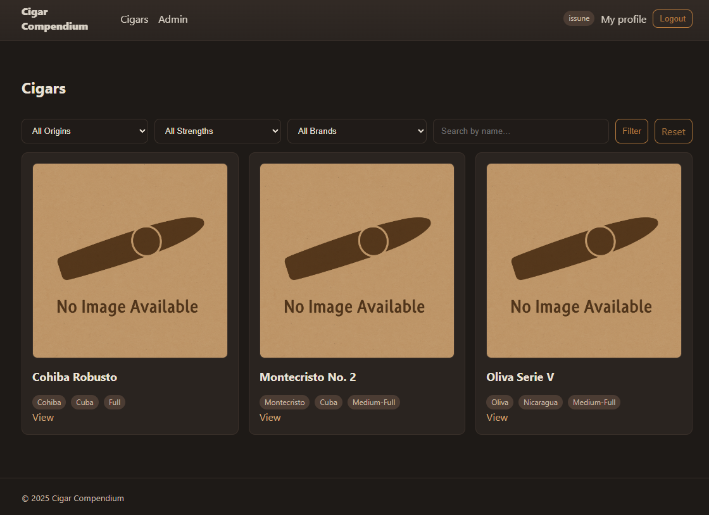
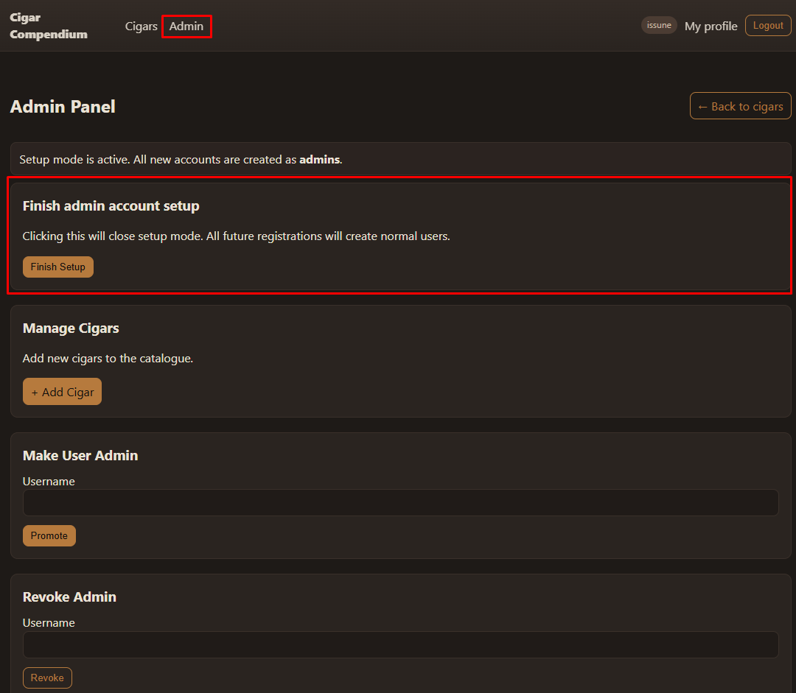

# Cigar Compendium

A small web application built as a personal project to create a **cigar catalog with reviews**.
The main objectives were:
* provide a structured way to browse and review cigars
* allow authentication and role-based access (admin vs. user)
* manage images, reviews, and cigar entries
* practice full-stack development with Spring Boot, Thymeleaf, and modern tooling

Users can browse cigars, add reviews with ratings and see other user's reviews with averages.
Admins can manage users, create and delete cigars (including reviews & images), and moderate content.

---

## Installation

Cigar Compendium is written with **Spring Boot**. To run:

1. Configure your database in `application.yml` (made for **MySQL**).
2. Compile with **Maven** and run the generated JAR file.
3. Start the application and access it at `http://localhost:8080/`.

Database schema is generated automatically from JPA entities along with examples.

The initial build comes with a couple of users, cigars and reviews to show basic possible setup and functions, it is
recommended to delete these users before using the app.

## Configuration
When first built, the app uses a "configuration mode", this is shown during registration, any users registered will obtain the Admin role.

As soon as you finish creating your admin accounts, turn this mode off in the Admin panel.

Admin privileges can be granted or revoked via admin accounts on the fly.

---

## Technologies

### Backend:
* **Java 17**
* **Spring Boot** (Web, Security, Data JPA, Thymeleaf integration)
* **Spring Security** for authentication & role management
* **Hibernate / JPA** for ORM
* **Jakarta Validation** for form and entity validation

### Frontend:
* **Thymeleaf** (templates & Spring Security integration)
* **Spring Security Thymeleaf Extras** for role-based templates
* **Custom CSS** (responsive, no frontend frameworks)

### Database:
* **MySQL**

### Tools:
* **Maven** (build & dependency management)
* **Lombok** (reduce boilerplate)
* **IntelliJ IDEA** (recommended IDE)

---

## Usage
* Registered users can:
  * Browse the cigar catalog
  * Submit their own reviews
* Admins can:
  * Create / Delete cigars
  * Manage reviews
  * Manage users and roles
